# The Profit Prophets - Strategy Sprint Submissions

This repository contains the consulting contest submission prepared by **The Profit Prophets** for Techkriti 2025 Strategy Sprint. It presents two strategy cases: a Reliance Retail logistics strategy and an ITC circular packaging strategy.

### Reliance Retail Logistics Case

The revenue share view frames the logistics challenge for Reliance Retail. Ajio, JioMart, Reliance Digital, Netmeds and Urban Ladder serve different product categories, customer expectations and delivery timelines, making a unified logistics strategy operationally complex.

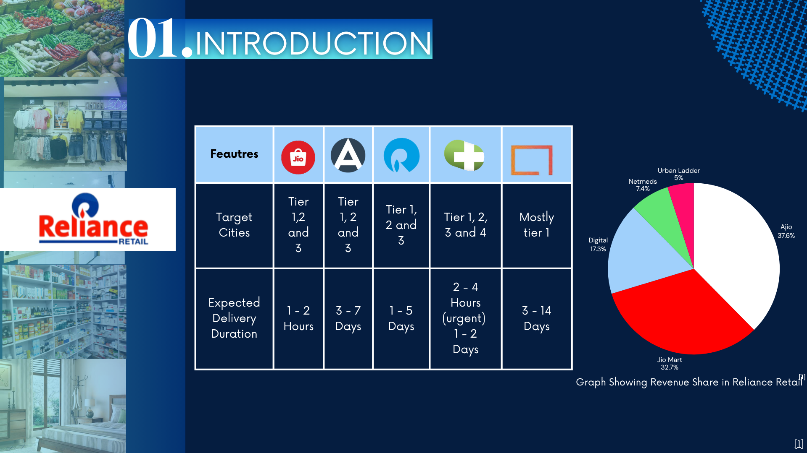

The logistics capability comparison benchmarks potential partners across the capabilities most relevant to Reliance Retail: pincode reach, D2C and B2B services, rapid commerce, freight, temperature controlled logistics, high value shipments, AI route optimization, WMS, geocoding APIs and reverse logistics.

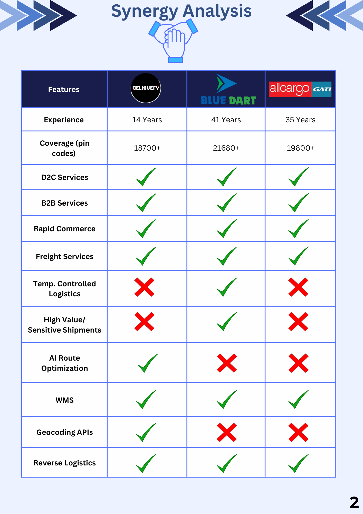

The acquisition cost benefit analysis connects the strategic shortlist to financial feasibility. It compares purchase price, transaction cost, integration cost, revenue synergies, cost synergies and market expansion potential across the evaluated logistics companies.

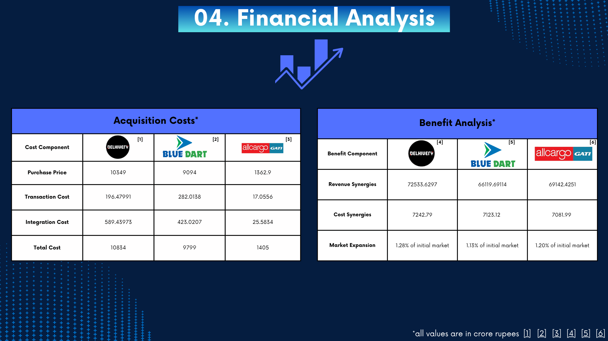

The Monte Carlo simulation adds a risk perspective to the valuation work. It shows how uncertainty in stock price outcomes, volatility, confidence intervals and threshold probabilities affects the attractiveness of each acquisition option.

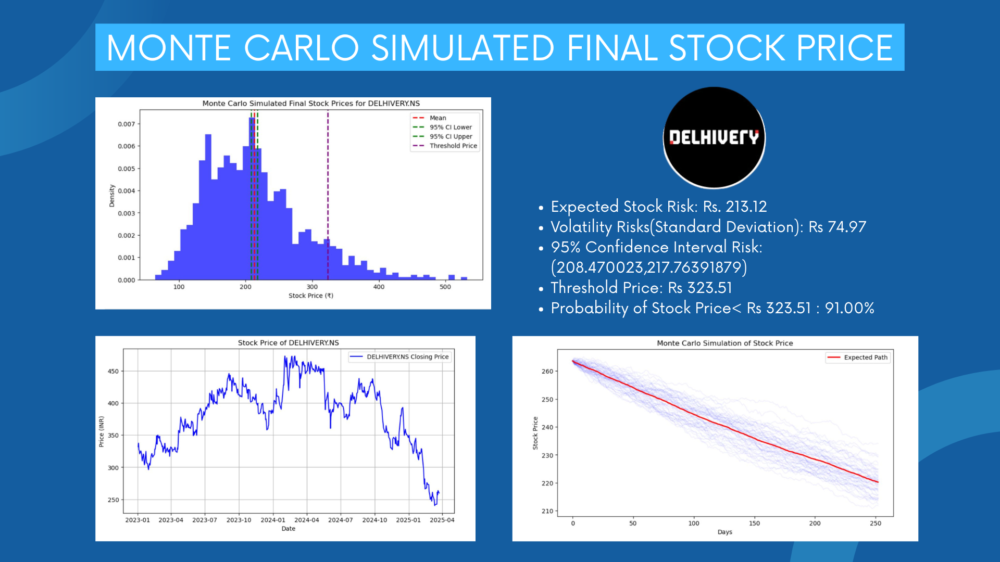

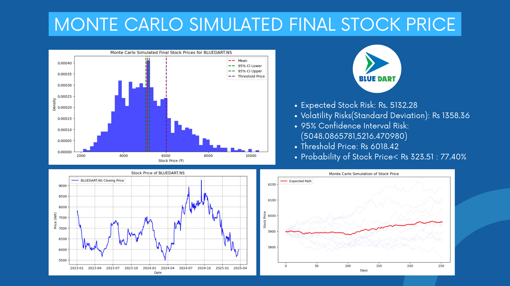

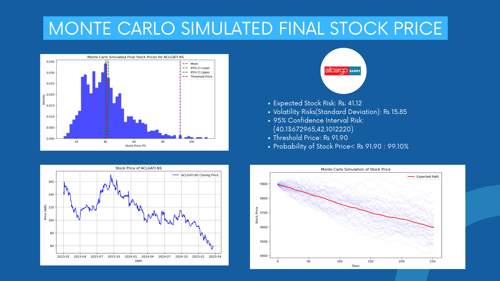

The implementation roadmap translates the recommendation into an execution sequence. It moves from strategic goal setting and due diligence to deal structuring, deal execution and post acquisition integration.

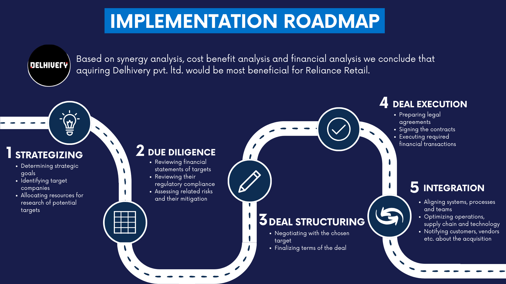

### Quantitative Model

The workbook `Retail Logistics Forecast.xlsx` supports the logistics recommendation through four model tabs:

| Sheet | Role |
| --- | --- |
| `Synergy R` | Estimates synergy revenue from Reliance Retail revenue, logistics company revenue and synergy growth assumptions. |
| `Market Share R` | Models market size, initial market share, expected share increase and resulting market share revenue. |
| `Customer Retention R` | Estimates retention driven revenue using customer base, increased retention rate and ARPU. |
| `Revenue Synergies` | Consolidates synergy revenue, market share revenue and customer retention revenue into final revenue synergy estimates. |

### Recommendation

The delivery deck concludes that **acquiring Delhivery Pvt. Ltd. would be most beneficial for Reliance Retail**, based on the combined synergy analysis, cost-benefit analysis, financial analysis and operational fit.

### ITC Rigid Plastic Reuse Case

The packaging waste composition chart establishes the scale of the problem and positions rigid plastic packaging as a meaningful intervention area within the broader plastic waste challenge.

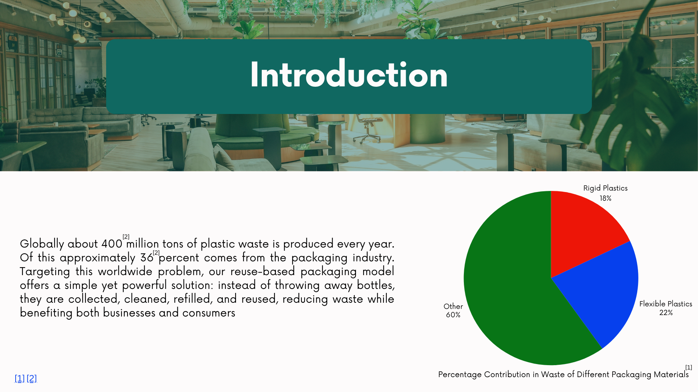

The reuse business model flow summarizes the proposed operating system. Packaging is collected, cleaned and quality checked, tracked through digital identifiers, refilled and redistributed through retail and online channels.

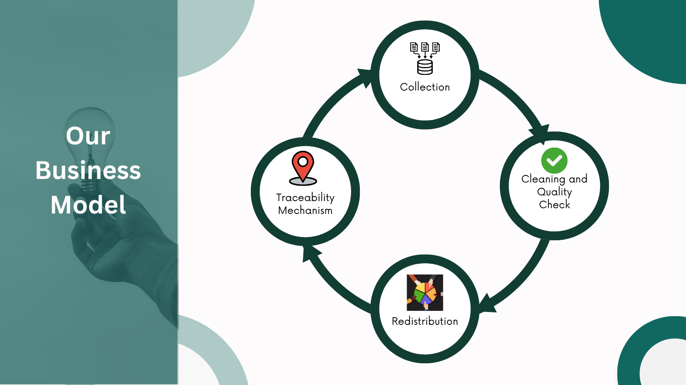

The collection channel model shows how reverse logistics can be built through multiple sourcing points, including retail stores, scrap dealers, aggregators, housing societies and supermarket kiosks.

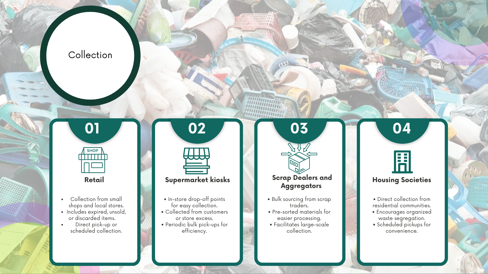

The triple-bottom-line assessment evaluates the reuse model beyond commercial viability. It captures the economic, social and environmental trade offs involved in shifting from single use packaging to a reusable packaging ecosystem.

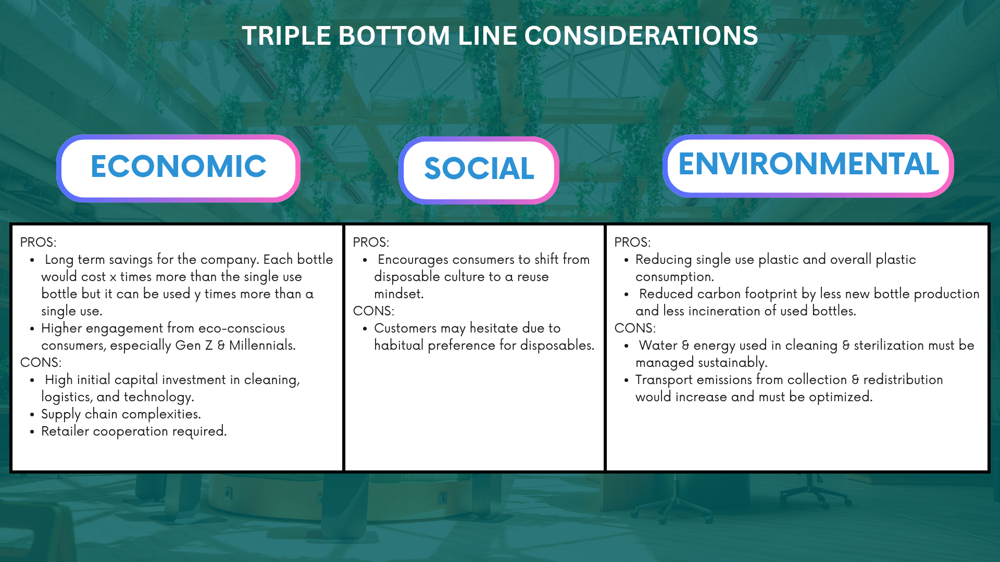

## Repository Structure

```text
Profit-Prophets-Techkriti-25/
│
├── README.md
│
├── assets/
│   └── images/
│       ├── acquisition-cost-benefit-analysis.png
│       ├── collection-channel-model.png
│       ├── implementation-roadmap.png
│       ├── logistics-capability-comparison.png
│       ├── monte-carlo-simulation-allcargo.png
│       ├── monte-carlo-simulation-bluedart.png
│       ├── monte-carlo-simulation-delhivery.png
│       ├── packaging-waste-composition.png
│       ├── reliance-retail-revenue-share.png
│       ├── reuse-business-model-flow.png
│       └── triple-bottom-line-assessment.png
│
├── case-study-1-logistics-acquisition/
│   ├── deliverables/
│   │   ├── strategy-sprint-logistics-acquisition-deck.pdf
│   │   └── strategy-sprint-abstract.pdf
│   │
│   └── analysis/
│       ├── retail-logistics-forecast.xlsx
│       ├── synergy-analysis-comparison.pdf
│       ├── acquisition-implementation-roadmap.pdf
│       └── project-plan-and-methodology.pdf
│
└── case-study-2-reusable-packaging/
    └── deliverables/
        └── strategy-sprint-reusable-packaging-deck.pdf
```


## Final Deliverables

| File | Description |
| --- | --- |
| `strategy-sprint-abstract.pdf` | Abstract for the Reliance Retail logistics case. |
| `strategy-sprint-logistics-acquisition-deck.pdf` | Comprehensive presentation deck for the Reliance Retail logistics case. It compares Delhivery, Blue Dart and Allcargo Gati. |
| `strategy-sprint-reusable-packaging-deck.pdf` | Presentation deck for the ITC reuse-of-rigid-plastic case. |

## Team

**The Profit Prophets**

- Vedika Yadav
- Vaibhav Vasudev
- Dipsikha Rano
- Yashjeet Singh
